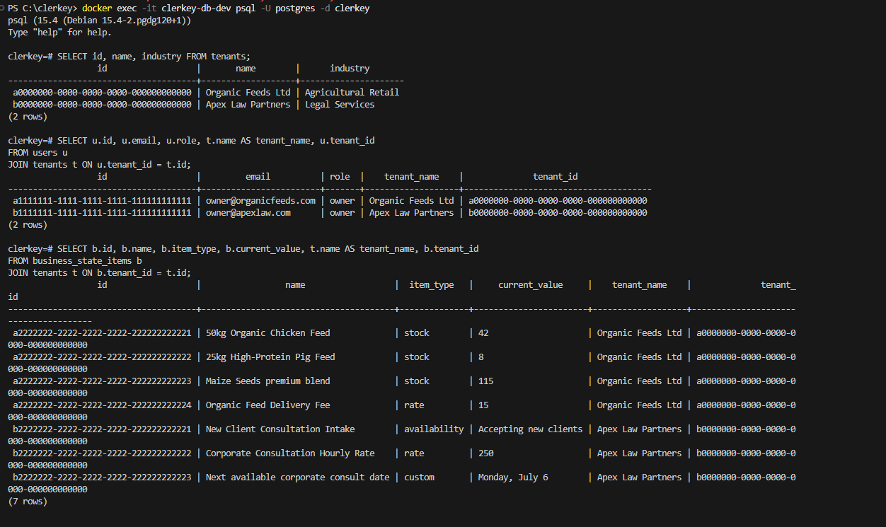
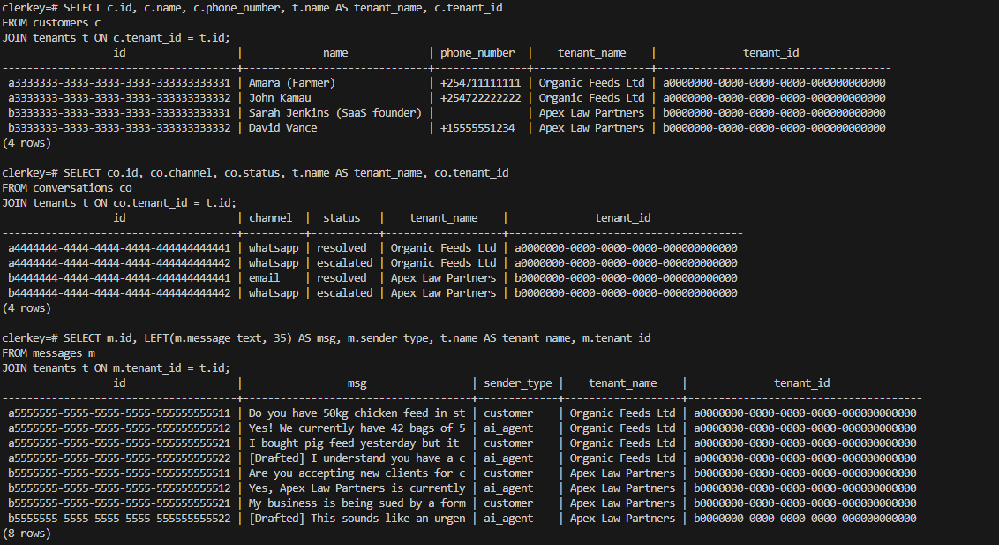

### Manually query the database and confirm tenant_id is present and correct on every row created by the seed script

1. Audit Tenant Scoping Summary

This query returns a count of rows per table grouped by their tenant mapping, allowing you to instantly confirm that no row is orphaned or missing a tenant_id:

`docker exec -i clerkey-db-dev psql -U postgres -d clerkey -c "
SELECT 'users' AS table_name, tenant_id, COUNT(*) FROM users GROUP BY tenant_id
UNION ALL
SELECT 'customers', tenant_id, COUNT(*) FROM customers GROUP BY tenant_id
UNION ALL
SELECT 'conversations', tenant_id, COUNT(*) FROM conversations GROUP BY tenant_id
UNION ALL
SELECT 'messages', tenant_id, COUNT(*) FROM messages GROUP BY tenant_id
UNION ALL
SELECT 'business_state_items', tenant_id, COUNT(*) FROM business_state_items GROUP BY tenant_id;
"`
2. Check for Nulls (Orphan Check)

Ensure there are absolutely no records in the database with a missing/null tenant_id:

`docker exec -i clerkey-db-dev psql -U postgres -d clerkey -c "
SELECT 
  (SELECT COUNT(*) FROM users WHERE tenant_id IS NULL) AS null_users,
  (SELECT COUNT(*) FROM customers WHERE tenant_id IS NULL) AS null_customers,
  (SELECT COUNT(*) FROM conversations WHERE tenant_id IS NULL) AS null_conversations,
  (SELECT COUNT(*) FROM messages WHERE tenant_id IS NULL) AS null_messages,
  (SELECT COUNT(*) FROM business_state_items WHERE tenant_id IS NULL) AS null_business_items;
"`
(All counts should return 0.)

###  Migrations run cleanly against a fresh local Postgres 
Done

### docs/data-model.md exists and matches the actual schema
Done