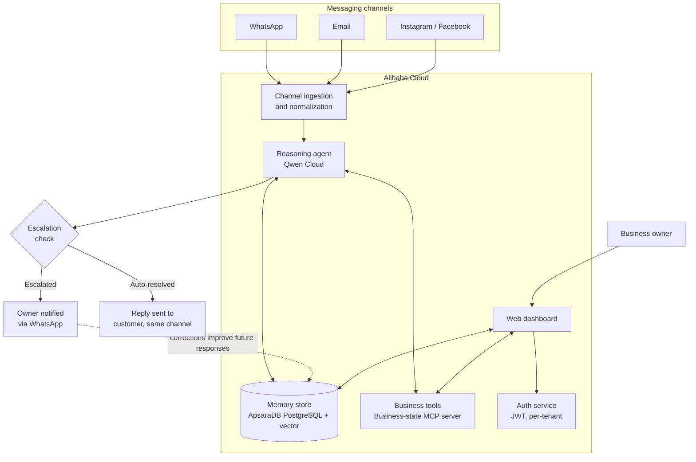

# Clerkey — Architecture

This document describes the system architecture for Clerkey: a multi-tenant AI agent
platform that responds to customer inquiries across messaging channels, checks the
business's current, live state — stock, availability, capacity, or rates, depending on
industry — before confirming anything to a customer, and improves over time from human
corrections.

Companion document: see `PRD.md` for requirements, scope, and acceptance criteria this
architecture is designed to satisfy.

---

## 1. System Overview

Every tenant (business) shares this same running deployment. Isolation between
tenants is enforced at the data-access layer, not just the UI — see Section 6.

---

## 2. Components

### 2.1 Channel adapters
One adapter per messaging channel (WhatsApp, Email, Instagram/Facebook). Each adapter's
only job is translating a platform-specific inbound message into Clerkey's internal
message format, and translating an outbound Clerkey response back into that platform's
send API. No business logic lives here — this is what makes adding a new channel later
a matter of writing one new adapter, not touching the agent.

Internal message format includes: `tenant_id`, `channel`, `customer_identifier`,
`message_text`, `timestamp`, `raw_payload` (kept for debugging/audit).

### 2.2 Ingestion & normalization
Receives normalized messages from every adapter, resolves which tenant and which
customer thread the message belongs to, and queues it for the reasoning agent. This is
also where basic spam/abuse filtering and rate limiting happen before anything reaches
the LLM layer.

### 2.3 Reasoning agent (Qwen Cloud)
The core decision-making layer. For each inquiry, it:
1. Retrieves relevant tenant context from the memory store (business profile, policies,
   customer history).
2. Calls the business-state MCP server to check the current, confirmed state of
   anything the customer mentioned — a stock count, a service availability, a rate,
   whatever applies to that tenant's industry.
3. Drafts a response using Qwen Cloud.
4. Produces a confidence/risk score for that draft.

Implemented as an explicit agent graph (not a single giant prompt), so each step —
retrieve, check business state, draft, score — is a distinct, testable node with its own
error handling.

### 2.4 Business tools layer (MCP)
Exposed as an MCP server rather than internal function calls, so the business-state
integration is a reusable, swappable component — not hard-coded into the agent, and not
specific to one industry. Current tools: `check_business_state(tenant_id, item)` —
returns the current value and last-confirmed timestamp for any business-state item,
whether that's a stock count, a service availability flag, or a rate —
`get_business_policy(tenant_id, topic)`, and `log_correction(tenant_id, draft,
`correction)`.

### 2.5 Memory store
ApsaraDB for PostgreSQL, with two layers:
- **Structured facts**: tenant profile, business-state items (stock counts,
  availability flags, rates — see PRD FR-5b), customer records — exact, queryable state.
- **Vector-indexed history**: past conversations and corrections, retrieved by semantic
  relevance to the current inquiry rather than raw recency, so the agent pulls in only
  what's actually useful within a limited context window.

A lightweight decay process deprioritizes stale facts (e.g., business-state items not
reconfirmed in a while) rather than letting them silently go wrong — see Section 5 for
the check-in mechanism that keeps this fresh.

### 2.6 Escalation logic
A confidence/risk threshold decides auto-reply vs. escalate. Escalation criteria include
low model confidence, detected disputes or complaints, order sizes above a
tenant-configurable threshold, and anything touching a policy the tenant hasn't defined.
Escalated conversations notify the owner directly over WhatsApp with a summary — no
separate approval app required for the MVP.

### 2.7 Web dashboard
Owner-facing only; no end customer ever sees this. Provides: onboarding flow,
conversation/escalation log, business-state view (adapted per industry — a stock table
for a retailer, an availability/rate list for a service business) with manual edit
option, business profile/policy settings, and basic analytics (response time,
auto-resolution rate, inquiry volume by channel).

### 2.8 Auth service
Self-built JWT auth (bcrypt-hashed passwords, access + refresh tokens), scoped per
tenant. No external managed auth provider — see PRD Section 10 for why.

---

## 3. Data flow (single inquiry, happy path)

1. Customer sends a WhatsApp message asking about stock (or, for a service business,
   asking whether the business is available to take on new work).
2. WhatsApp adapter normalizes it and hands it to the ingestion layer.
3. Ingestion resolves the tenant and customer thread, queues the message.
4. Reasoning agent retrieves tenant context from memory, calls the business-state MCP
   tool for the current, confirmed state of the relevant item.
5. Agent drafts a response and scores confidence as high (simple, unambiguous inquiry).
6. Escalation check passes it straight through — reply sent back via the WhatsApp
   adapter, same channel the customer used.
7. The interaction is logged to memory (structured + vector) for future retrieval and
   shown in the dashboard's conversation log.

Escalated path diverges at step 6: instead of sending to the customer, the draft and a
summary go to the owner over WhatsApp. If the owner edits the draft before it's sent,
that correction is captured via `log_correction` and stored in memory, shaping future
responses for that tenant.

---

## 4. Data model (summary)

Full schema lives in `docs/data-model.md`. Every table carries a `tenant_id` foreign
key, indexed and enforced at the query layer (see Section 6).

- `tenants` — business profile, policies, tone preferences, plan/status
- `users` — owner (and future staff) accounts, scoped to a tenant
- `customers` — end customers per tenant, keyed by channel identifier
- `conversations` / `messages` — full inquiry history, tagged auto-resolved or escalated
- `business_state_items` — any fact about the business that can go stale: a name
  (e.g., "50kg maize bags," "new client intake," "mobile app development package"), a current value (quantity, boolean
  availability, price, or short status text), last-confirmed timestamp and source.
  One general shape covers stock, capacity, availability, and pricing across
  industries — see PRD FR-5b.
- `corrections` — draft vs. human-edited pairs, used as learning signal
- `channel_connections` — per-tenant, encrypted credentials for each connected channel

---

## 5. Ongoing business-state maintenance (proactive check-ins)

Rather than asking owners to maintain a dashboard, Clerkey pushes short WhatsApp
check-in messages when a business-state item may be stale — whether that item is a
stock count or a service availability flag. Trigger rule (see PRD Section 10):

- 2+ customer inquiries about the same item within a rolling 24-hour window, **or**
- 48 hours since that item was last confirmed by the owner

whichever happens first. The owner's plain-text reply (e.g., "12 left," "still taking
new clients") is parsed and written back to `business_state_items`, updating both the
value and its confirmation timestamp.

---

## 6. Multi-tenant isolation strategy

This is the most safety-critical part of the architecture, since Clerkey holds live
customer conversations and business data for multiple independent businesses in one
deployment.

- Every table that holds tenant data includes a non-nullable `tenant_id`.
- All data access goes through a query layer that requires and injects the
  authenticated request's `tenant_id` — there is no code path that queries these tables
  without a tenant filter.
- JWTs issued at login are scoped to exactly one tenant; a token from one tenant cannot
  be used to read another tenant's data regardless of what's requested.
- MCP tool calls (business-state lookups, policy lookups) always receive `tenant_id` as
  a required parameter, not inferred implicitly, so a tool cannot accidentally answer
  with another tenant's data.
- Isolation is tested directly (see PRD acceptance criteria): two seeded test tenants,
  deliberately from different industries, are used to confirm neither can read the
  other's conversations, business-state data, or customers — verified by attempting it,
  not assumed from the schema.

---

## 7. Error handling & graceful degradation

- **Qwen Cloud unavailable / rate-limited**: inquiry is queued and the customer receives
  a brief acknowledgment ("we got your message, one moment") rather than silence or a
  broken reply; retried with backoff.
- **Business-state / MCP tool call fails**: agent does not guess at stock, availability,
  or rates — it escalates to the owner rather than confirming or denying incorrectly.
- **Channel API failure on send**: retried; if still failing, escalation surfaces in the
  dashboard so the owner knows a reply didn't go out.
- **Ambiguous or out-of-policy inquiry**: escalates by design rather than attempting a
  best-guess auto-reply — this is a deliberate default, not a fallback for a bug.

---

## 8. Deployment (Alibaba Cloud)

- **Compute**: Alibaba Cloud Function Compute (or ECS, decided at build time based on
  setup speed) runs the backend — ingestion, orchestration, MCP server, dashboard API.
- **Database**: ApsaraDB for PostgreSQL holds structured tenant data; vector search
  runs alongside it (pgvector) rather than a separate vector DB, to keep infrastructure
  minimal for the hackathon scope.
- **Proof of deployment**: a short screen recording (separate from the main demo video)
  plus a linked code file in the repo showing direct Alibaba Cloud SDK/API usage — see
  submission requirements in `README.md`.

---

## 9. Scalability path (beyond hackathon scope)

- Adding a new channel = writing one new adapter; no changes to the orchestration or
  memory layers.
- Adding a new tenant = a signup flow, not a deployment — already true by design since
  multi-tenancy is built in from the start, not retrofitted.
- Staff roles, billing, and a real approval UI (beyond WhatsApp-based escalation) are
  natural next additions once the core loop is proven, without requiring an
  architectural rewrite — the tenant/role/auth structure already anticipates them.

---

## 10. Track alignment

Submitted primarily under **Track 4 (Autopilot Agent)** — end-to-end business workflow
automation with tool invocation, ambiguous-input handling, and human-in-the-loop
checkpoints. The memory/learning system (Section 2.5, Section 5) also reflects **Track 1
(MemoryAgent)** priorities — efficient retrieval, timely forgetting of stale
business-state facts, and recall within a limited context window — called out as a
secondary strength rather than a formal dual-track submission.
